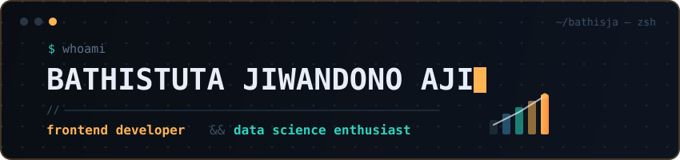

<h1 align="center">
  
</h1>

<h3 align="center">
  
</h3>

<h3 align="center">
  <a href="https://bathistuta.netlify.app/"></a>
  <a href="mailto:bathistutajiwandonoaji@gmail.com"></a>
</h3>

---

## 📄 `about.yaml`

```yaml
$ cat about.yaml
role: frontend developer && data science enthusiast
focus:
  - building immersive user experiences
  - extracting data-driven insights
exploring: machine learning
principle: creativity × analytical problem-solving
status: open to collaborate
```
---

<div align="center">
  <samp>© 2026 · <a href="https://github.com/BathisJA">BathisJA</a> · built with ☕</samp>
</div>
